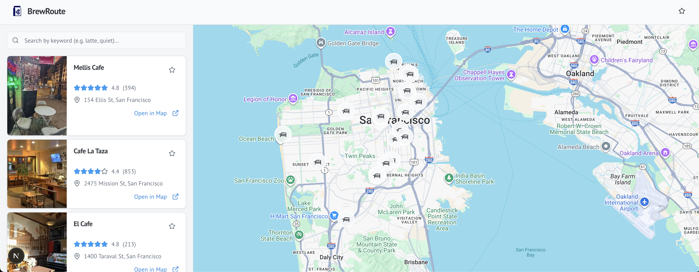

<p align="center">
  
</p>

<p align="center">
  
  
  
  
</p>

<h2 align="center">✨ BrewRoute ✨</h2>

<p align="center">
  BrewRoute is a dynamic, map-based application designed to help users effortlessly discover nearby cafés tailored to their current location. With an intuitive interface, users can quickly access essential details such as ratings, precise addresses, and up-to-date opening hours. The app also features a convenient "save favorite" functionality, allowing users to bookmark their beloved coffee spots with a single click for future reference.
</p>

---

## 🔥 Features

- ⚡ Built with **Next.js, Tailwind CSS, TypeScript, Framer Motion**
- 🗺️ **Interactive Map View**: Discover cafés dynamically displayed on an intuitive map interface.
- 📍 **Location-Based Search**: Instantly find coffee shops closest to your current position.
- ⭐ **Detailed Café Information**: Access comprehensive details including user ratings, full addresses, and current operating hours.
- ❤️ **Favorite Spots Management**: Easily save and revisit your preferred cafés with a dedicated favorites list.
- 🔍 **Seamless User Experience**: Enjoy a smooth and responsive interface designed for quick and easy navigation.

---

## 🚀 Live Demo

👉 [Visit The Website](https://brew-route.vercel.app/)

---

## 🛠️ Setup & Run

```bash
git clone https://github.com/SawSimonLinn/brewRoute
cd BrewRoute
npm install

npm run dev
```

## 🔑 Environment Variables

To run this project, you will need to add the following environment variables to your .env file:

```
NEXT_PUBLIC_GOOGLE_MAPS_API_KEY=your_api_key_here

```

---

## 💬 Feedback

Feel free to connect with me or drop feedback via [LinkedIn](https://www.linkedin.com/in/sawsimonlinn/). Let’s build something magical together! 💻✨

---

## 📄 License

This project is licensed under the MIT License.
